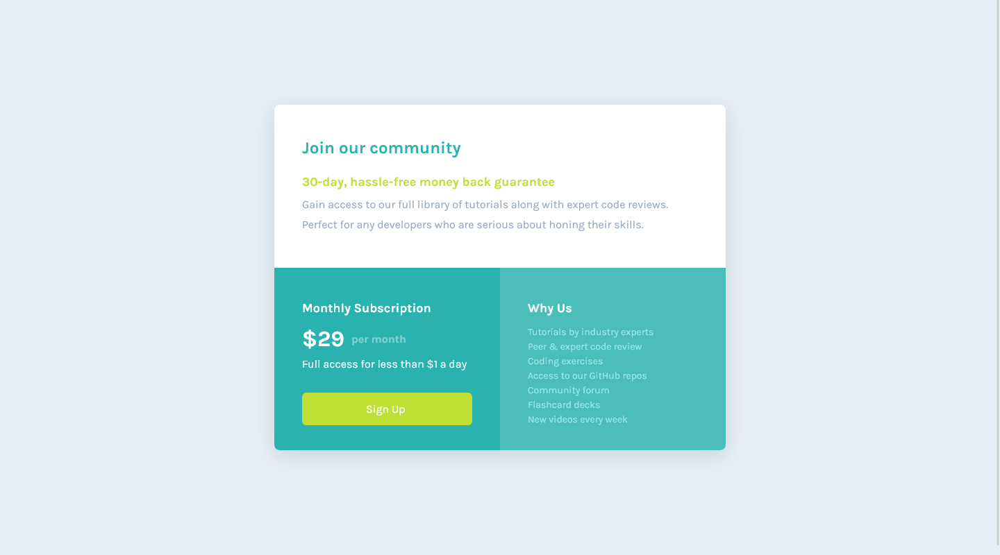

# Frontend Mentor - Single price grid component solution

This is a solution to the [Single price grid component challenge on Frontend Mentor](https://www.frontendmentor.io/challenges/single-price-grid-component-5ce41129d0ff452fec5abbbc). Frontend Mentor challenges help you improve your coding skills by building realistic projects. 

## Table of contents

- [Overview](#overview)
  - [The challenge](#the-challenge)
  - [Screenshot](#screenshot)
  - [Links](#links)
- [My process](#my-process)
  - [Built with](#built-with)
- [Author](#author)

## Overview

In this challenge, you will build out the pricing component to the designs provided. This is perfect for beginners and people who want to complete a smaller challenge.

### The challenge

Users should be able to:

- View the optimal layout for the component depending on their device's screen size
- See a hover state on desktop for the Sign Up call-to-action

### Screenshot

### Links

- Solution URL: [https://github.com/mohamedKhaled89/huddle-landing-page-with-single-introductory-section]
- Live Site URL: [https://mohamedkhaled89.github.io/huddle-landing-page-with-single-introductory-section/]

## My process

### Built with

- Semantic HTML5 markup
- CSS custom properties
- Flexbox
- CSS Grid

## Author

- Frontend Mentor - [@mohamedKhaled89](https://www.frontendmentor.io/profile/mohamedKhaled89)
